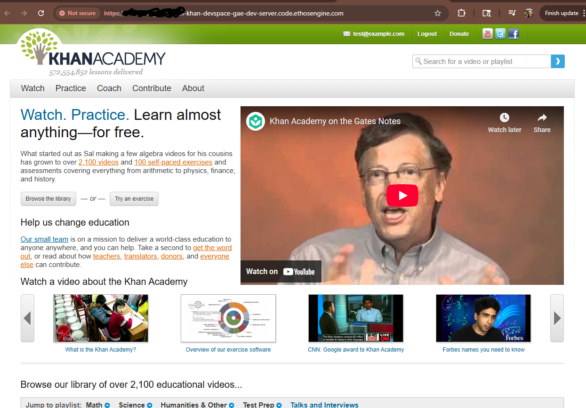
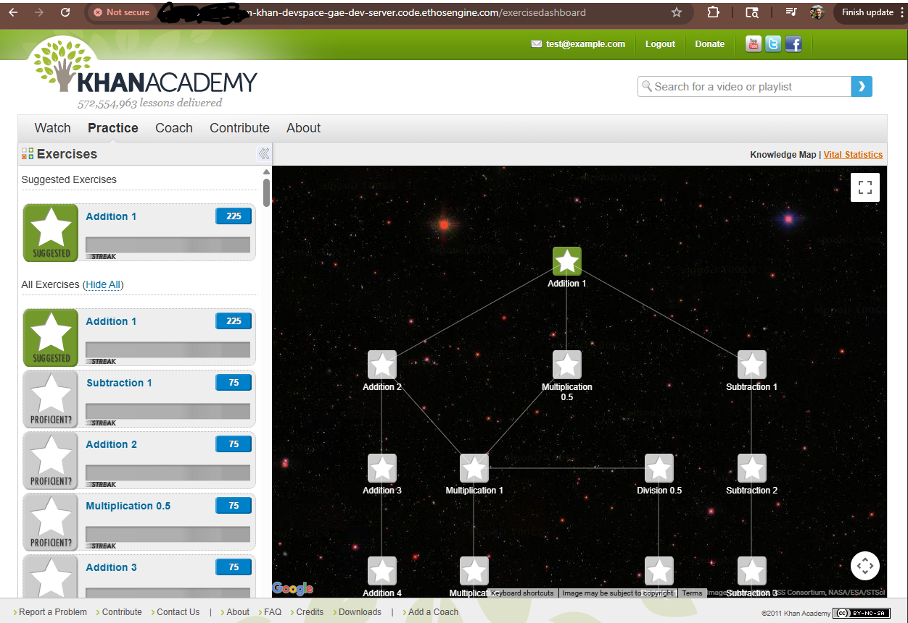

# Khan Academy Legacy Platform

[](https://code.ethosengine.com/#https://github.com/Mbd06b/khanacademy)

## Historical Overview

This is a preserved snapshot of Khan Academy's educational platform from 2010-2012, representing a pivotal moment in online education history. This codebase powered millions of students' mathematical education and demonstrated that high-quality, personalized learning could be delivered at global scale.

**⚠️ Legacy Notice**: This is a historical artifact using deprecated Google App Engine Python 2.7 runtime, preserved for educational and research purposes.

## Platform Screenshots

### Homepage

*The main homepage featuring Sal Khan's introductory video, library browser, and navigation to exercises*

### Knowledge Map & Exercise Dashboard  

*The interactive knowledge map showing prerequisite relationships between math topics and student progress*

## Historical Significance

### Educational Innovation (2010-2012)
- **Personalized Learning**: Students progressed through math topics based on mastery, not time
- **Gamification**: Energy points, badges, and streak mechanics motivated learning
- **Data-Driven Education**: Detailed analytics tracked learning patterns and identified struggling students
- **Free Access**: High-quality education made available to anyone with internet access

### Technical Innovations
- **Interactive Exercises**: JavaScript-based math problem generators with immediate feedback
- **Knowledge Map**: Visual representation of prerequisite relationships between topics
- **Scalable Architecture**: Google App Engine handled massive user loads
- **Streak System**: 10 consecutive correct answers required for exercise mastery

## Architecture (Historical)

**Technology Stack:**
- Google App Engine Python 2.7 (deprecated)
- Django 1.1 templates with custom GAE integration
- Google Datastore (NoSQL)
- JavaScript exercise framework
- YouTube video integration

**Core Data Models:**
- `UserData`: Student progress and analytics
- `Exercise`: Math problems with prerequisites  
- `Video`: Educational content
- `ProblemLog`: Individual problem attempts
- `UserExercise`: Student mastery tracking

## Development Environment

The legacy runtime requirements are documented in a two-stage containerized development setup:

### Container Build Process

**Stage 1: Base Development Image (`udi-base.dockerfile`)**
```dockerfile
FROM quay.io/devfile/universal-developer-image:ubi9-latest
```
Installs modern development tools:
- **Claude Code**: AI coding assistant (`@anthropic-ai/claude-code`)
- **Java 21**: OpenJDK for modern tooling
- **CLI Tools**: tree, htop, fzf, tmux for development productivity
- **SonarQube MCP**: Code quality analysis integration

**Stage 2: Legacy GAE Runtime (`udi-gae-legacy.dockerfile`)**
```dockerfile
FROM harbor.ethosengine.com/devspaces/udi-plus:latest
```
Builds the deprecated Python 2.7 + GAE environment:

### Runtime Requirements
- **Python 2.7.18**: Compiled from source with shared libraries
  - Source: `https://www.python.org/ftp/python/2.7.18/Python-2.7.18.tgz`
  - Build dependencies: gcc, openssl-devel, libffi-devel, zlib-devel
- **Google App Engine SDK 1.9.91**: Last version supporting Python 2.7
  - Source: `https://storage.googleapis.com/appengine-sdks/featured/google_appengine_1.9.91.zip`
- **Legacy Python packages** (exact versions for compatibility):
  - webapp2==2.5.2, jinja2==2.10.1, webob==1.8.7
  - django==1.3.7, pyyaml==3.13, requests==2.25.1
  - Optional: lxml==4.2.6, pillow==6.2.2 (with fallbacks)

### Container Build Commands
Build your own development images using the provided dockerfiles based on Universal Developer Image (UDI) for Eclipse Che compatibility:
- `udi-base.dockerfile` for the base image with modern tools
- `udi-gae-legacy.dockerfile` for the legacy GAE runtime environment

### Setup Commands
From `devfile.yaml`, the environment setup includes:

1. **Environment Check**:
   ```bash
   gae-check  # Verify Python 2.7 and GAE SDK installation
   ```

2. **Start Development Server**:
   ```bash
   run-gae-dev-server  # Launches GAE dev server on port 8080
   ```

3. **Load Sample Data** (optional):
   ```bash
   load-sample-data  # Populates datastore with 48 playlists, 2128 videos, exercises, the gae-dev-server must be running.
   ```

### Access Points
- Main application: http://localhost:8080
- GAE admin console: http://localhost:8000

## Educational Impact

This codebase pioneered concepts that became standard in educational technology:

- **Mastery-based progression** instead of time-based advancement
- **Learning analytics** for personalized education
- **Gamification elements** that motivated sustained engagement
- **Teacher dashboards** for classroom integration
- **Open educational resources** supporting global access

## File Structure

```
├── main.py                 # Application entry point
├── models.py              # Educational data models
├── app.yaml               # GAE configuration
├── exercises/             # Math problem templates
│   ├── addition_1.html    # Basic arithmetic
│   ├── algebra_*.html     # Equation solving
│   └── calculus_*.html    # Advanced topics
├── javascript/            # Exercise framework
├── sample_data/           # Development test data
└── devfile.yaml          # Modern development setup
```

## Recent Modernization

Recent commits show efforts to preserve this historical codebase:

- **Template compatibility patches**: Fixed Django template registration for modern environments
- **HTTPS migration**: Updated embedded content for security
- **Container development**: Docker setup for running legacy Python 2.7 stack and Google Apps Engine
- **Eclipse Che integration**: Cloud development environment configuration

## Research Value

This codebase provides insights into:

- **Early EdTech architecture patterns** and scaling solutions
- **Gamification implementation** in educational contexts  
- **Learning analytics** data collection strategies
- **Open source educational content** development approaches

The code demonstrates how a small team created a platform that fundamentally changed how millions of students learn mathematics, establishing patterns that continue to influence educational technology today.

---

*This repository preserves an important milestone in educational technology history, documenting Khan Academy's transformation from video library to interactive learning platform.*